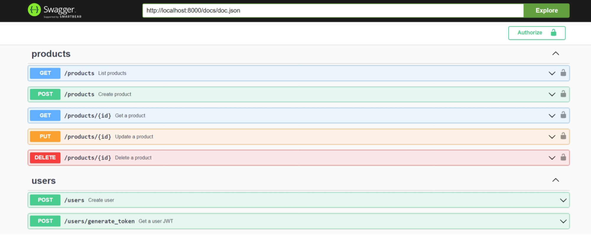

# Exemplo de API Go Expert



Esta é uma API simples desenvolvida em Go, que oferece autenticação e operações CRUD para produtos. A API utiliza `JWT` para acesso seguro e inclui `Swagger` para documentação da API.

## Funcionalidades

- **Autenticação de Usuário**: Gera tokens JWT para acesso seguro à API.
- **Gerenciamento de Produtos**: Criação, consulta, atualização e exclusão de produtos.
- **Documentação Swagger**: Explore e teste os endpoints da API facilmente.

## Início Rápido

### Pré-requisitos

- Go 1.22+
- SQLite3 (opcional, caso queira usar outro banco de dados, ajuste a configuração conforme necessário)

### Instalação

1. **Clone o repositório**:
    ```bash
    git clone https://github.com/valdir-alves3000/postgraduate-challenges-go-expert.git
    cd postgraduate-challenges-go-expert/APIs
    ```

2. **Instale as dependências**:
    ```bash
    go mod tidy
    ```

3. **Configure o ambiente**:
   - Crie um arquivo `.env` no diretório raiz e adicione as seguintes variáveis de ambiente:
     ```
     DB_DRIVER=
     DB_HOST=
     DB_PORT=
     DB_USER=root
     DB_PASSWORD=
     DB_NAME=test
     WEB_SERVER_PORT=8000
     JWT_SECRET=your_jwt_secret
     JWT_EXPIRESIN=
     ```

### Executando a Aplicação

1. **Execute a API**:
    ```bash
    go run main.go
    ```

2. **Acesse a Documentação Swagger**:
   - Abra seu navegador e vá para `http://localhost:8000/docs/` para explorar a documentação da API.

### Endpoints da API

- **Endpoints de Usuário**:
  - `POST /users`: Cria um novo usuário.
  - `POST /users/generate_token`: Gera um token JWT para autenticação.

- **Endpoints de Produto** (Requer Autenticação):
  - `POST /products`: Cria um novo produto.
  - `GET /products`: Lista todos os produtos.
  - `GET /products/{id}`: Consulta detalhes de um produto específico.
  - `PUT /products/{id}`: Atualiza um produto existente.
  - `DELETE /products/{id}`: Exclui um produto.

### Autenticação

- **Token JWT**: 
  - Após criar um usuário, gere um token JWT utilizando o endpoint `/users/generate_token`.
  - Inclua o token no cabeçalho `Authorization` para acessar as rotas protegidas.
