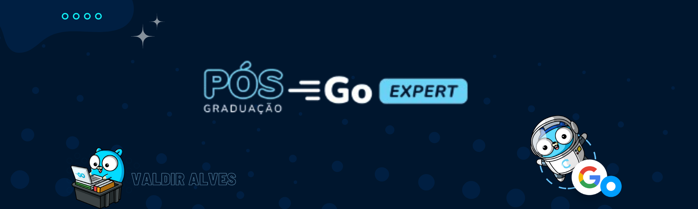

# Postgraduate Challenges - Go Expert


Bem-vindo ao repositório **Postgraduate Challenges - Go Expert**! Este projeto foi desenvolvido como parte de uma pós-graduação focada em estruturas de software com Go e Docker. 

## Objetivo

O objetivo deste repositório é fornecer uma série de desafios práticos que ajudam a aprofundar o conhecimento e a habilidade em desenvolvimento com a linguagem Go, abordando desde conceitos básicos até técnicas avançadas. 

## Estrutura

O repositório está organizado em **Challenges**:

- **[Client-Server](client-server)**
  - **Client**: Contém os desafios e exercícios relacionados ao desenvolvimento de clientes em Go.
  - **Server**: Abriga os desafios e exercícios focados em desenvolvimento de servidores utilizando Go. 

- **[APIs](APIs)**: Esta é uma API simples que oferece autenticação e operações CRUD para produtos. 
  
- **[Multithreading](multithreading)**
  - **[Cep Lookup](multithreading/cep-lookup)**: Consulta de endereços a partir de CEPs.

Cada diretório possui seu próprio README com instruções detalhadas e explicações para facilitar a navegação e o entendimento.

## Como Utilizar

1. **Clone o repositório:**
   ```bash
   git clone https://github.com/valdir-alves3000/postgraduate-challenges-go-expert.git
   ```


2. **Siga as instruções no README de cada diretório para iniciar os desafios.**

## Contato

Para mais informações ou dúvidas, entre em contato pelo [e-mail](valdir:valdiralves3000@gmail.com)
