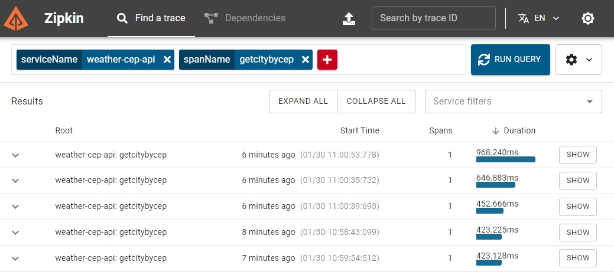

# 🌤️ Weather CEP API  

## 🔹 Visão Geral  
O **Weather CEP API** é um serviço escrito em **Go** que permite obter a temperatura de qualquer cidade no Brasil a partir de um **CEP**. Ele integra as APIs:  
✅ **ViaCEP** – Para buscar informações da cidade.  
✅ **WeatherAPI** – Para obter os dados meteorológicos em **°C, °F e K**.  

🔗 **URL da API no Cloud Run:**  
[🔗 Acesse aqui](https://weather-cep-api-160835378410.us-central1.run.app/docs)  

---

## ⚡ Funcionalidades  
✔️ Validação de **CEP** de 8 dígitos.  
✔️ Consulta de cidade utilizando a API do **ViaCEP**.  
✔️ Temperatura em **Celsius, Fahrenheit e Kelvin**.    
✔️ Tratamento de erros com mensagens claras.  
✔️ Suporte a execução **local** e via **Docker**.  
✔️ **Tracing distribuído** com **OpenTelemetry** e **Zipkin**.  
✔️ Testes unitários abrangentes para garantir a qualidade do código.  

---

## 🛠️ Tecnologias  
**Linguagem:** Go 1.21+  
**APIs Externas:**  
- [ViaCEP](https://viacep.com.br)  
- [WeatherAPI](https://www.weatherapi.com)

**Containerização:** Docker & Docker Compose  
**Tracing:** OpenTelemetry e Zipkin  
**Testes:** Testes unitários com `testing` padrão do Go  

---

## Configuração de Variáveis de Ambiente

Crie um arquivo `.env` na raiz do projeto com as seguintes variáveis:

```bash
WEATHER_API_KEY=your_weather_api_key
```

---

## ⚙️ Como Usar  

### 🔹 Localmente (Sem Docker)  
```bash
git clone https://github.com/valdir-alves3000/postgraduate-challenges-go-expert.git
cd weather-cep-api
go mod tidy
go run cmd/main.go
```
**Acesse:** `http://localhost:8080/temperature/{cep}`  

---

### 🔹 Com Docker  
```bash
docker build -t weather-cep-api .
docker run -p 8080:8080 --env-file .env weather-cep-api
```
**Acesse:** `http://localhost:8080/temperature/{cep}`  

---

### 🔹 Com Docker Compose (Incluindo Zipkin)  
```bash
docker-compose up
```
**Acesse:**  
- API: `http://localhost:8080/temperature/{cep}`  
- Zipkin: `http://localhost:9411`  

---

## 🧪 Testes Unitários  

O projeto inclui testes unitários do TemperatureHandler para garantir a qualidade do código. 

Os testes cobrem os seguintes cenários:  

✅ **Sucesso ao buscar temperatura** para um CEP válido.  
✅ **Erro de CEP inválido** (formato incorreto).  
✅ **Erro de cidade não encontrada** (CEP inexistente).  
✅ **Erro de temperatura não encontrada** (cidade sem dados meteorológicos).  

### Como Executar os Testes  
```bash
go test ./internal/handlers
```

---

## 🔍 Tracing Distribuído com Zipkin  

O projeto utiliza **OpenTelemetry** e **Zipkin** para tracing distribuído, permitindo monitorar e depurar requisições entre serviços.  

### Como Funciona  
- Cada requisição à API é rastreada com spans para medir o tempo de resposta das operações de busca de CEP e temperatura.  
- Os traces são enviados para o **Zipkin**, onde podem ser visualizados e analisados.  

### Preview do Zipkin  
👇 Esta é uma prévia da interface do Zipkin mostrando os traces da API: 👇  

  

---

### 🔹 Exemplo de Resposta  
**Requisição:**  
```http
GET /temperature/09321450
```

**Resposta:**  
```json
{
  "city": "Mauá",
  "country": "Brasil",
  "localtime": "2025-01-27 10:00",
  "tempC": 25.0,
  "tempF": 77.0,
  "tempK": 298.0
}
```

---

## 📌 Deploy Automático  

O projeto está configurado para deploy automático via **Cloud Build** e **Cloud Run**.  

🔗 **Preview no Cloud Run:**  
[🌐 Weather CEP API](https://weather-cep-api-160835378410.us-central1.run.app/docs)  

---
